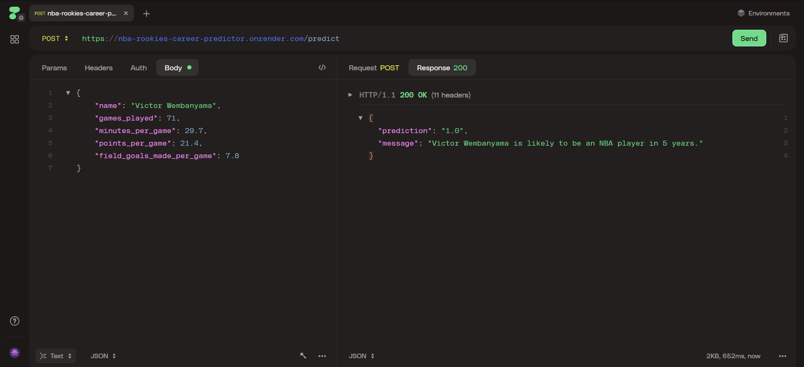

# NBA Rookies Career Predictor

<br />
<div align="center">
  <a href="https://www.nba.com/news/victor-wembanyama-named-2023-24-kia-nba-rookie-of-the-year">
    
  </a>

<h3 align="center">NBA Rookies Career Predictor</h3>

  <p align="center">
    <a href="https://nba-rookies-career-predictor.onrender.com">API Demo on Render</a>
  </p>
</div>

## About The Project

The aim of this project is to develop a classification model in order to predict whether an NBA rookie will last 5 or more years in the league, thereby determining the potential return on investment.
The analysis and modelling was done in Jupyter Notebooks, and the selected classifier was deployed as an API.
The API is also hosted though free billing on Render, one [native Python version](https://nba-rookies-career-predictor.onrender.com) and one [Docker version](https://nba-rookies-career-predictor-docker.onrender.com).




## Getting Started

### Prerequisites

- Python 3.9+
- `pip` for package installation

### Installation

1. Clone the repo
    ```sh
    git clone https://github.com/eidpeter/nba-rookies-career-predictor.git
    ```
2. Navigate into the project directory
    ```sh
    cd nba-rookies-career-predictor
    ```
3. Install the required Python packages
    ```sh
    pip install -r requirements.txt
    ```
4. (Optional) Set up a virtual environment for dependency management
    ```sh
    virtualenv env
    ```
    ```sh
    .\env\Scripts\activate
    ```

## Project structure

- `app`
    - `\_\_init\_\_.py`
    - `main.py` : contains the API
- `data`
    - `nba_logreg_preprocessed.csv` : cleaned dataset
    - `nba_logreg.csv` : original dataset
- `misc`
    - `demo.png` : screenshot for README
- `models`
    - `nba_classifier.pkl` : the trained classification model
- `notebooks`
    - `01-EDA.ipynb` : exploratory data analysis and data preprocessing notebook
    - `02-model_exploration.ipynb` : comparison of different classifiers
- `Dockerfile` : Dockerfile used to create a Docker image
- `requirements.txt` : Python project dependencies
- `test.py` : initial Python script 


## Usage

1. Run the FastAPI server:

```sh
uvicorn app.main:app --reload
```

2. Use an API client like Postman or cURL to send POST requests to the /predict endpoint. Here’s an example request using cURL:

```sh
curl -X 'POST' \
  'http://127.0.0.1:8000/predict' \
  -H 'accept: application/json' \
  -H 'Content-Type: application/json' \
  -d '{
    "name": "Victor Wembanyama",
    "games_played": 71,
    "minutes_per_game": 29.7,
    "points_per_game": 21.4,
    "field_goals_made_per_game": 7.8
}'
```


## Roadmap

- [ ] Add prediction confidence score to API response
- [ ] Explore more classification models (like LDA, QDA, AdaBoost, ...)
- [ ] Try other combinations of features for model training
- [ ] Add more documentation, docstrings, and comments
